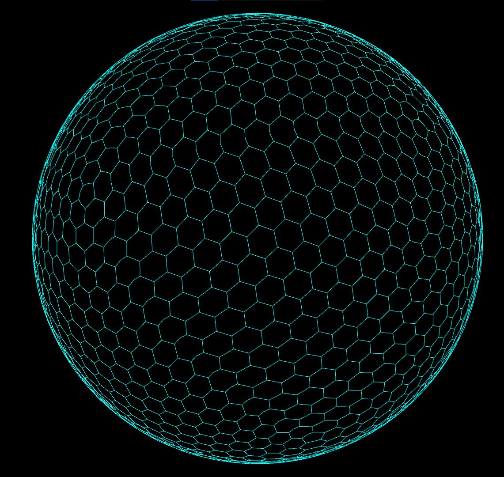

# Hexagonal-sphere

Implementation of a famous algorithm for drawing hexagonal grid onto a sphere:
Projecting a regular dodecahedron with triengulated sides, then chosing the appropiate set of vertices and edges to form the hexagonal grid:

